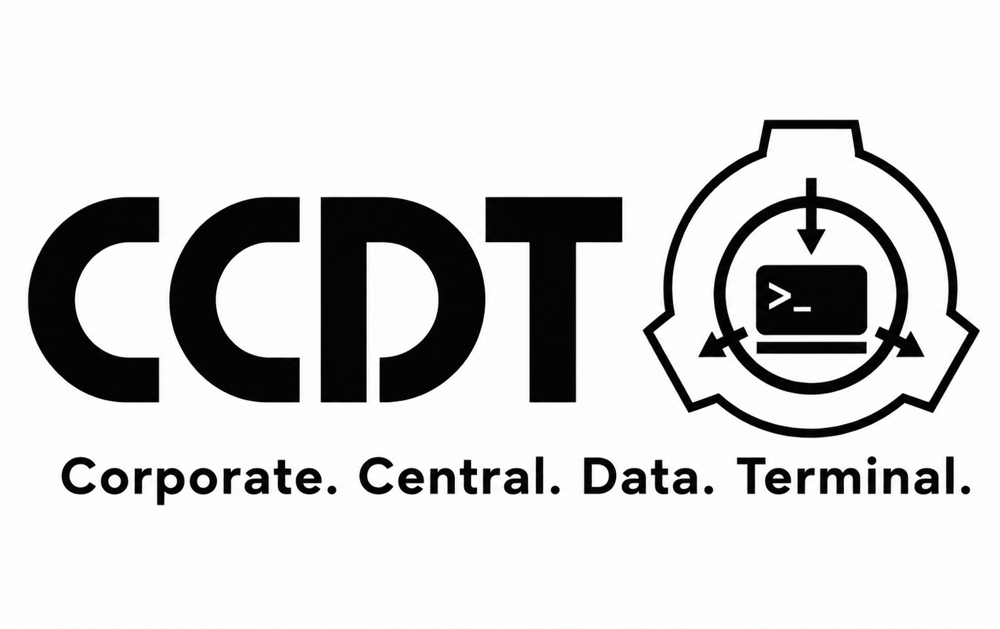

# CCDT — Corporate Central Data Terminal

<p align="center">
  
</p>

<p align="center">
  <em>A multi-tenant, permission-aware command terminal for browsing internal company documents. Inspired by the SCiPNET aesthetic, built for real organizations that need to keep their archives separate.</em>
</p>

---

## What it is

CCDT is a **company archives terminal**. You type `access <number>` in the
terminal, and the system retrieves the matching document — the same core
logic as the SCiPNET command `access [archive number]`, but for internal
company records instead of SCP articles.

The terminal is **monospace, phosphor-green on near-black**, with a SCiPNET
boot card, an O5 emergency broadcast popup, a visual vault browser, and a
branch-of-powers pyramid for org-chart inspection. Every operator belongs
to one or more **vaults** — closed workspaces where archives, messages,
and member lists are strictly isolated.

**Live deployment** (hosted on Vercel): a Vite + React 18 SPA talking to a
Supabase backend (PostgREST + RLS + Realtime). The full multi-tenant model
is enforced by Postgres RLS, not by the client.

## Highlights

| Feature | What it does |
|---------|--------------|
| **`access <n>`** | Open archive `#n` as a Word-style dossier — title, classification placard, body, attachments |
| **`vault <name> [password]`** | Create a new vault (admin/O5 tier required); you become the owner |
| **`vaults`** | List the vaults you belong to; switch the active vault with `vaultswitch <id>` |
| **`VAULTS` tab** | Browse public vaults, see their PUBLIC-clearance archives, request to join |
| **BRANCH OF POWERS** | Visual pyramid of every member of a vault, top-to-bottom (owner → admin → member) |
| **Internal mail** | `mail inbox`, `mail send <user>`, `mail send all <sub> <body>` (O5 only) — with classification + priority |
| **O5 broadcast** | O5 holders can flash-broadcast an emergency message that freezes every connected terminal |
| **Vault invites** | `invite <user> to <vault> [as role] [clearance N]` — recipient gets a `[VAULT INVITE]` mail with a one-click ACCEPT button |
| **Public vault discovery** | Outsiders browse PUBLIC vaults, see public archives, and `requestjoin` from a button |
| **Three-axis authority model** | Global tier (user/admin/O5) — vault role (owner/admin/member) — vault-internal clearance (PUBLIC..TOP SECRET), all decoupled |
| **Public static for AI agents** | Pre-rendered `/llms.txt`, `/llms-full.txt`, `/api/agent.json`, `/api/archives.json`, per-archive JSON/MD/HTML, `/sitemap.xml` — no auth, plain static on Vercel CDN |

## Authority model — three independent axes

CCDT decouples **three orthogonal dimensions** of authorization:

### 1. Global tier (platform-wide)
Stored in `auth.users.raw_user_meta_data.clearance_level`.

| Value | Tier | What they can do |
|-------|------|------------------|
| **1** | **user** | Baseline. Read + create inside vaults they're a member of. |
| **2–3** | **admin** | Above + **read the activity log** across all vaults (audit power). |
| **4–5** | **O5** | Above + promote/demote admins and O5s + cross-vault audit + O5 broadcast. |

### 2. Vault role (per-vault, in `vault_members.role`)

| Role | Who can grant | Powers |
|------|---------------|--------|
| **owner** | Created with the vault; unique | Invite, remove members, set vault-internal clearance, transfer ownership, reset password, toggle public, delete vault (if empty) |
| **admin** | Promoted by owner (or existing admin, with cap) | Invite, remove members, set vault-internal clearance **up to their own clearance**, grant/revoke visit grants, resolve join requests |
| **member** | Default on invite | Create + edit + read archives in the vault (subject to their vault-internal clearance) |

### 3. Vault-internal clearance (per-vault, in `vault_members.clearance`)

| Level | Label | What they can read inside the vault |
|-------|-------|--------------------------------------|
| 1 | **PUBLIC** | PUBLIC-classified archives only |
| 2 | **CONFIDENTIAL** | PUBLIC + CONFIDENTIAL |
| 3 | **SECRET** | PUBLIC + CONFIDENTIAL + SECRET |
| 4 | **TOP SECRET** | All archives in the vault (owner is always treated as TOP SECRET regardless of stored value) |

The two clearance scales never interact. A global `user` can hold TOP
SECRET clearance inside vault X, and a global `O5` can be demoted to
PUBLIC inside vault Y. Vault-internal clearance is local trust;
global tier is platform power.

### Outsiders (no `vault_members` row)

| State | Default access |
|-------|----------------|
| No membership + vault is `is_public=true` | Can read PUBLIC-classified archives of that vault |
| No membership + vault is private | Default access = none |
| Visit grant via `allow <user> read <lvl> in <v> for <h>h` | Temporarily treated as having vault-internal clearance `<lvl>` for `<h>` hours |
| Demoted (fired) | Becomes an outsider again; can re-apply via `requestjoin` |

## Commands

| Command | Action |
|---------|--------|
| `access <number>` | Open archive `#<number>` (the dossier) |
| `list [n]` | List the `n` most recent archives (default 10) |
| `search <query>` | Search archives by title / content |
| `create` | **Guided wizard** to author a new archive document |
| `load` / `import` | **Import a document from a file** (`.json` / `.txt` / `.md`) |
| `database` (terminal tab → `VAULTS`) | Browse public vaults, request to join, see BRANCH OF POWERS |
| `vault <name> [password]` | Create a new vault (admin/O5 only) — you become the owner |
| `vaults` | List the vaults you belong to |
| `vaultswitch <id>` | Set the active vault |
| `vaultmembers <id>` | List members of a vault |
| `vaultinvites <id>` | List pending invites |
| `invite <user> to <vault> [as role] [clearance N]` | Invite someone (owner/admin) |
| `acceptinvite <token>` | Consume a vault invite (or click ACCEPT on the mail) |
| `setrole <vault> <user> <owner\|admin\|member>` | Promote/demote (owner only for owner role) |
| `setclearance <vault> <user> <1-4>` | Set vault-internal clearance (admin capped by own clearance) |
| `fire <vault> <user>` | Remove a member from a vault (they become an outsider) |
| `vaultpass <vault> <old> <new>` | Reset vault password (owner only) |
| `transfervault <vault> to <user>` | Initiate ownership transfer (target must accept; old owner removed) |
| `accepttransfer <token>` / `declinetransfer <token>` | Consume or reject a transfer |
| `setpublic <vault> on\|off` | Toggle the public flag (owner only) |
| `allow <user> read <lvl> in <vault> for <h>h` | Grant temporary visitor access |
| `revokeallow <vault> <user>` | Revoke a visit grant early |
| `visitgrants <vault>` | List active visit grants |
| `requestjoin <vault> [message]` | Apply to join a vault |
| `joinrequests <vault>` | Queue of pending applications (owner/admin) |
| `approvejoin <request_id>` / `declinejoin <request_id>` | Resolve a join request |
| `mail inbox` / `mail sent` / `mail send` / `mail <id>` | Mail UI — inbox/sent/view/compose |
| `mail send all <subject> <body>` | O5-only: broadcast to every connected terminal with screen freeze |
| `login [email pw]` | Authenticate (prompts if no args) |
| `register <email> <pw> <level>` | Create an operator account (clearance level 1-4) |
| `logout` | End session |
| `who` | Live scan of who's online right now |
| `whoami` | Show current operator |
| `about` | What this is |
| `clear` | Clear screen |
| `help` | Command list |

### `create` — new document wizard
`create` asks, step by step:
```
ARCHIVE NUMBER:      unique id, e.g. 042
TITLE:               short title
CLASSIFICATION:      PUBLIC | CONFIDENTIAL | SECRET | TOP SECRET
DEPARTMENT:          owning team (optional)
CONTENT:             multi-line body — type, then a blank line to finish
TAGS:                comma separated (optional)
```
Type `cancel` at any prompt to abort. The document is committed to Supabase
(or to the local session in DEMO mode) and is then retrievable with `access <number>`.

### `load` — import a file
`load` opens a file picker. Supported inputs:
- **`.json`** using fields `archive_number, title, classification, department, content, tags`
- **`.txt` / `.md`** — filename becomes the title, file text becomes the content (classification `PUBLIC`)

## Tech stack

- **Frontend:** Vite + React 18, plain JS modules for the terminal core, no heavy framework
- **Backend:** Supabase (PostgREST + RLS + Realtime), 1300+ lines of `migration_*.sql` covering the full multi-tenant model
- **Storage:** Single shared `photos` bucket with vault-prefixed paths
- **Hosting:** Vercel CDN, static SPA + pre-rendered AI-agent endpoints (`/llms.txt`, `/api/agent.json`, etc.)
- **Realtime:** Supabase broadcast channels for presence (`who`) and O5-emergency broadcasts
- **Build:** `npm run build` (Vite) + a custom Node script that pre-renders the public agent-facing files

## Quick start (runs immediately, no backend needed)

```bash
npm install
npm run dev
```

Open the printed URL. It boots in **DEMO MODE** with sample archives — try `login`, then `access 173`, `list`, `search printer`.

## Connect your Supabase backend

1. Create a Supabase project (free tier is fine).
2. Run the migration files in `supabase/` **in order**, starting from `schema.sql`, then each `migration_00N_*.sql`. Migration 006 is the big one — it builds the entire vault authorization model.
3. **Authentication → Users → Add user** to create operator accounts (passwords are hashed by Supabase — you never store them).
4. Copy `.env.example` → `.env` and fill in:
   ```
   VITE_SUPABASE_URL=https://YOUR-PROJECT-REF.supabase.co
   VITE_SUPABASE_ANON_KEY=your-anon-public-key
   ```
   (found at **Project Settings → API**). The app only goes "live" once a real `supabase.co` URL is set; the placeholder stays in DEMO MODE.

> A publishable/anon key is already present in `.env` — just replace the `VITE_SUPABASE_URL` placeholder with your project's URL.

## Project layout

```
company-archive-terminal/
├── src/
│   ├── App.jsx              — main shell, tab bar, vault picker, terminal bootstrap
│   ├── VaultBrowser.jsx     — VAULTS tab (public vault discovery, BRANCH OF POWERS)
│   ├── DatabaseView.jsx     — legacy DB browser (kept for reference)
│   ├── mailboxWindow.jsx    — mail UI with one-click ACCEPT for vault invites / transfers / join requests
│   ├── dossierWindow.jsx    — archive viewer (Word-style)
│   ├── presence.js          — realtime presence (`who`) with live-scan on command
│   ├── o5Popup.js           — O5 emergency-broadcast modal
│   └── terminal/
│       ├── commands.js      — every terminal command + vault RPC wrappers
│       └── theme.css        — single CSS file for the whole terminal aesthetic
├── supabase/
│   ├── schema.sql           — bootstrap (archives + clearances)
│   ├── migration_002_users_and_messages.sql
│   ├── migration_003_*.sql
│   ├── migration_004_o5_clearance.sql
│   ├── migration_005_*.sql
│   └── migration_006_vaults.sql  — the multi-tenant vault authorization model
├── scripts/
│   └── build-agent-static.mjs  — pre-renders /llms.txt, /api/agent.json, per-archive files
├── public/
│   ├── favicon.png + favicon-16/32/64/180/192/512.png
│   ├── ccdt-logo.png + ccdt-mark.png
│   └── apple-touch-icon.png
├── .github/
│   └── ccdt-logo.png        — repo logo (used at the top of this README)
└── index.html               — Vite entry, favicon + apple-touch-icon declarations
```

## Security model in one paragraph

Every archive is a row in `public.archives` with a `vault_id citext` and
a `classification` (PUBLIC / CONFIDENTIAL / SECRET / TOP SECRET).
Row-level security on `archives_read` runs `can_read_vault_archive(vault_id,
classification)`, which checks: (a) are you a member of the vault, (b)
do you have an active visit grant with sufficient clearance, (c) is the
vault `is_public` and the archive is PUBLIC-classified, or (d) are you a
global admin/O5 doing audit. Every mutating RPC is `SECURITY DEFINER`,
takes `p_vault_id`, and verifies `is_vault_owner_or_admin(p_vault_id)` or
similar before acting. The client never sees denied rows — it gets a
`CLEARANCE INSUFFICIENT` line instead of a leak.

## Build

```bash
npm run build      # outputs to dist/
npm run preview    # serve the production build
node scripts/build-agent-static.mjs   # pre-render AI-agent public files
```

## License

MIT — see `LICENSE`.